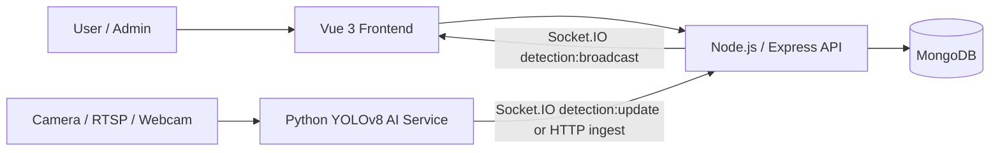

# Project Architecture Structure

This project is a full-stack bus-stop monitoring platform with a web frontend, a backend API, a MongoDB database, and an AI-based live human detection service.

This document describes the current runtime architecture. Process-oriented or historical documents in `docs/agents`, `docs/tasks`, `docs/changes`, and some legacy notes should be checked against the current source before being used as implementation guidance.

## 1. High-Level Architecture



## 2. Main Components

### Frontend Layer
- Built with Vue 3 and Vite.
- Handles UI pages such as login, dashboard, live feed, analytics, feedback, map, and settings.
- Uses Vue Router for navigation and a service layer for API communication.

### Backend Layer
- Built with Node.js and Express.
- Exposes REST endpoints for authentication, stations, buses, feedback, analytics, settings, and live feed operations.
- Uses Socket.IO for real-time updates and live detection events.
- Implements JWT-based authentication and role-based access control.

### AI Layer
- Python service that runs YOLOv8 object detection.
- Processes camera streams from webcams or RTSP sources.
- Sends detection results to the backend by Socket.IO `detection:update` or HTTP `/api/livefeed/update`.
- Exposes an MJPEG preview stream at `/stream` for the current backend/frontend livefeed path.
- Can run standalone or as a backend-managed child process for configured camera hardware.

### Data Layer
- MongoDB stores users, stations, buses, feedback, settings, and analytics data.
- The backend uses Mongoose schemas to interact with the database.
- `settings.hardware[]` stores camera configuration. Online camera hardware with an RTSP URL can trigger backend-managed detector processes.
- `hourly_analytics` stores hourly queue metrics derived from AI detection updates.

## 3. Runtime Deployment Structure

The project is containerized with Docker Compose.

```text
Client Browser
  -> Frontend container
  -> Backend container
  -> MongoDB container
  -> AI container (optional standalone profile)

Configured Camera Hardware
  -> Backend-managed Python detector process
  -> Backend Socket.IO / stream proxy
```

### Services in Compose
- Frontend: serves the Vue application.
- Backend: runs the Express API and Socket.IO server.
- MongoDB: stores persistent application data.
- AI: optional standalone detector service for live camera processing. The backend image also contains AI support for dynamically managed cameras.

## 4. Internal Module Breakdown

### Frontend Structure
- src/views/: main application pages
- src/components/: reusable UI components
- src/service/: API communication helpers
- src/router/: route definitions and guards
- src/lib/: utility modules
- src/composables/: shared frontend logic

### Backend Structure
- app.js: main server entry point
- models/: Mongoose schemas
- scripts/: database or maintenance scripts

### AI Structure
- detect_humans_live-api.py: main detection pipeline
- requirements.txt: Python dependencies
- yolov8*.pt: pre-trained YOLO weights

## 5. Request Flow Example

1. A user opens the web UI.
2. The frontend calls the backend API.
3. The backend validates authentication and interacts with MongoDB.
4. If a live camera feed is active, the AI service processes frames.
5. Detection results are forwarded to the backend.
6. The backend updates analytics and pushes real-time events to the frontend.

## 6. Livefeed Flow

1. Admin configures hardware in settings.
2. If a hardware item is a camera, online, and has `rtspUrl`, the backend starts a detector process.
3. The detector reads the camera stream and runs YOLO person detection.
4. The detector sends metadata through Socket.IO `detection:update` or HTTP `/api/livefeed/update`.
5. The backend normalizes detection status and updates in-memory live state.
6. The backend updates `hourly_analytics` when MongoDB is connected.
7. The backend broadcasts `detection:broadcast` to connected clients.
8. The frontend livefeed page displays stream and detection metadata.

## 7. Documentation Map

Detailed handover documents live in `docs/handover/`:

- Setup: `docs/handover/SETUP.md`
- Environment: `docs/handover/ENVIRONMENT.md`
- API: `docs/handover/API.md`
- Database: `docs/handover/DATABASE.md`
- Authorization: `docs/handover/AUTHORIZATION.md`
- AI livefeed: `docs/handover/AI-LIVEFEED.md`
- Deployment: `docs/handover/DEPLOYMENT.md`
- Testing: `docs/handover/TESTING.md`
- Troubleshooting: `docs/handover/TROUBLESHOOTING.md`
- Handover checklist: `docs/handover/HANDOVER-CHECKLIST.md`

## 8. Architecture Summary

This project follows a modular three-tier architecture:
- Presentation tier: Vue frontend
- Application tier: Node.js/Express backend with real-time communication
- Data/AI tier: MongoDB and Python YOLOv8 detection service

This design supports web-based monitoring, real-time analytics, and camera-based passenger detection in a single platform.
